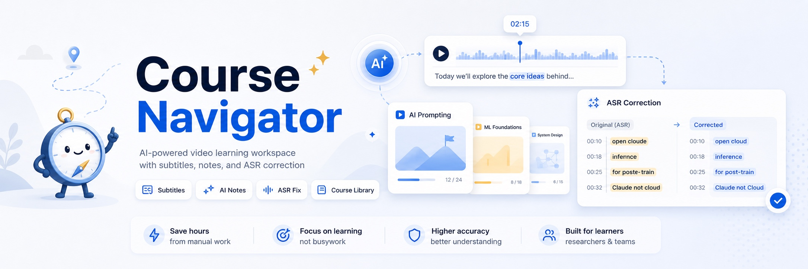

# Course Navigator

[中文说明](README.md)



Course Navigator is a video course workspace that turns subtitles into a navigable study experience. Paste a video URL or import a local video, extract subtitles, review the transcript beside the video, organize lessons into collections, and use AI to translate, analyze, and correct ASR text.

It is built for learners, researchers, and course-heavy teams who need to understand long videos quickly, keep course material organized, and jump back to the right moment during review.

## Interface Preview


## Highlights

- Course library and workspace: organize lessons into collections, edit titles and order, import local videos, cache online videos, and keep course records, AI study material, and local video files in one workspace.
- Course package sharing: import or export single lessons and full collections with corrected subtitles, translated subtitles, AI study material, notes, collection names, and lesson order.
- Subtitle acquisition: extract platform subtitles with `yt-dlp`, or use local upload, local ASR, online ASR, source-first fallback, and Simplified Chinese normalization.
- Video access: use direct access for public videos, or reuse browser login and cookies files for sites that require authentication.
- Playback and review: link video playback with transcripts, jump by timestamp, use bilingual subtitle views, navigate timestamps, and translate subtitles and titles.
- AI study maps: generate a guide, outline, interpretation, and detailed notes with standard or high-fidelity detail, plus beginner and advanced learning suggestions.
- ASR correction workbench: use reference terms, targeted AI suggestions, before/after comparison, hover reasons, confidence sorting, threshold acceptance, and auto-save.
- Search validation: optionally validate ASR correction candidates with Tavily, hosted Firecrawl, or self-hosted Firecrawl.
- Model profiles: share one model profile library across translation, study generation, and ASR correction, with OpenAI-compatible and Anthropic formats.

## Requirements

- Node.js 20.19+ on the Node 20 line, or Node.js 22.12+ on Node 22 and newer, with npm.
- Python 3.11 or newer.
- `uv` for Python dependency management.
- `ffmpeg`, optional at startup but required for local video cache, audio extraction, and media conversion.
- `curl`, used by the start script to check service readiness.

`yt-dlp` is installed with the Python dependencies.

The app can start without `ffmpeg`. Install it when you need media cache or local audio workflows:

```bash
# macOS
brew install ffmpeg

# Ubuntu or Debian
sudo apt install ffmpeg

# Windows
winget install Gyan.FFmpeg
```

## Quick Start

```bash
git clone https://github.com/Liu-Bot24/course-navigator.git
cd course-navigator
npm start
```

The start command installs dependencies, creates local settings when needed, and starts both the API and web app. If `ffmpeg` is missing, startup shows a warning and continues.

Open:

```text
http://127.0.0.1:5173
```

Press `Ctrl+C` in the terminal to stop both services.

## macOS Local Install

The current macOS installer and Homebrew Cask support Apple Silicon Macs. Intel Mac builds are not provided yet.

If you have Homebrew installed, you can install the app from the GitHub release:

```bash
brew tap liu-bot24/course-navigator https://github.com/Liu-Bot24/course-navigator
brew install --cask liu-bot24/course-navigator/course-navigator
```

To upgrade later with Homebrew:

```bash
brew update
brew upgrade --cask liu-bot24/course-navigator/course-navigator
```

You can also download the macOS installer, open the DMG, drag `Course Navigator.app` to `Applications`, and launch it from there.

For an unnotarized build, macOS may require `System Settings` → `Privacy & Security` → `Open Anyway` on first launch. Once you confirm the installer source and approve it, the app opens normally.

See [macOS Local Install](docs/mac-install.en.md) for the full install steps.

## AI Setup

Course Navigator can extract, browse, and manually edit subtitles without an AI model. AI translation, study generation, and ASR correction need at least one model profile.

In the app settings, create a model profile, choose a provider format, enter the API address, model name, and API key, then assign profiles to the tasks you want:

| Task | What it does |
| --- | --- |
| Subtitle model | Subtitle and title translation |
| Study model | Interpretation and detailed study text |
| Structure model | Context summaries, semantic blocks, guide, and outline |
| ASR correction model | Correction suggestions in the ASR workbench |

Model profiles support:

| Provider format | Typical API address |
| --- | --- |
| OpenAI compatible | `https://api.openai.com/v1` or another compatible endpoint |
| Anthropic | `https://api.anthropic.com/v1` or a compatible Anthropic endpoint |

The app also reads optional environment settings:

| Setting | Controls | Default |
| --- | --- | --- |
| `COURSE_NAVIGATOR_WORKSPACE_DIR` | Course workspace for records, AI study material, imported videos, and local video caches | `course-navigator-workspace` |
| `COURSE_NAVIGATOR_DATA_DIR` | Local runtime data for subtitle extraction and ASR work files | `.course-navigator` |
| `COURSE_NAVIGATOR_LLM_BASE_URL` | Optional single-profile API address | Empty |
| `COURSE_NAVIGATOR_LLM_API_KEY` | Optional single-profile API key | Empty |
| `COURSE_NAVIGATOR_LLM_MODEL` | Optional single-profile model name | Empty |
| `COURSE_NAVIGATOR_ASR_SEARCH_ENABLED` | Enables search-assisted ASR correction | `false` |
| `COURSE_NAVIGATOR_ASR_SEARCH_PROVIDER` | Search provider for ASR validation | `tavily` |
| `COURSE_NAVIGATOR_ASR_SEARCH_RESULT_LIMIT` | Search results per query | `5` |
| `COURSE_NAVIGATOR_TAVILY_API_KEY` | Tavily API key | Empty |
| `COURSE_NAVIGATOR_FIRECRAWL_BASE_URL` | Firecrawl API address | Empty |
| `COURSE_NAVIGATOR_FIRECRAWL_API_KEY` | Firecrawl API key | Empty |
| `COURSE_NAVIGATOR_ONLINE_ASR_PROVIDER` | Online ASR provider: `none`, `xai`, `openai`, `groq`, or `custom` | `none`; a configured key can be selected automatically |
| `COURSE_NAVIGATOR_XAI_ASR_API_KEY` | xAI online ASR API key | Empty |
| `COURSE_NAVIGATOR_OPENAI_ASR_API_KEY` | OpenAI Whisper API key | Empty |
| `COURSE_NAVIGATOR_GROQ_ASR_API_KEY` | Groq Whisper API key | Empty |
| `COURSE_NAVIGATOR_CUSTOM_ASR_BASE_URL` | Custom online ASR endpoint | Empty |
| `COURSE_NAVIGATOR_CUSTOM_ASR_MODEL` | Custom online ASR model name | Empty |
| `COURSE_NAVIGATOR_CUSTOM_ASR_API_KEY` | Custom online ASR API key | Empty |
| `COURSE_NAVIGATOR_ASR_CACHE_AUTO_CLEANUP_ENABLED` | Automatically cleans ASR audio work cache when it grows past 500 MB | `true` |

Firecrawl can use the hosted service or a self-hosted service:

| Mode | Firecrawl address | API key |
| --- | --- | --- |
| Hosted Firecrawl | `https://api.firecrawl.dev` | Use the API key from the Firecrawl dashboard |
| Self-hosted Firecrawl | Your Firecrawl service address, for example `http://192.168.1.10:3002` | Fill it in if authentication is enabled; otherwise leave it empty |

You can enter the service root URL. Course Navigator uses `/v1/search` for search requests, so `https://api.firecrawl.dev` becomes `https://api.firecrawl.dev/v1/search`.

Online ASR can be configured in app settings. Preset providers only need an API key; custom endpoints need a base URL, model name, and API key. ASR tries to produce subtitles in the source video language; translation remains a separate subtitle translation step.

The startup script supports custom local ports:

| Setting | Controls | Default |
| --- | --- | --- |
| `COURSE_NAVIGATOR_API_HOST` | API host | `127.0.0.1` |
| `COURSE_NAVIGATOR_API_PORT` | API port | `8000` |
| `COURSE_NAVIGATOR_WEB_HOST` | Web app host | `127.0.0.1` |
| `COURSE_NAVIGATOR_WEB_PORT` | Web app port | `5173` |

## Video Access

Course Navigator supports three extraction modes:

| Mode | Use when |
| --- | --- |
| Normal | The video is public and can be accessed directly |
| Browser login | The video works in your browser and needs your logged-in session |
| Cookies file | You already have an exported cookies file for the site |

Supported sites, subtitle languages, and automatic captions depend on `yt-dlp` and the source platform.

`Browser login` uses `chrome` by default; an empty `Cookie source` is also treated as `chrome`. To choose a specific source, use:

| Cookie source | What it uses |
| --- | --- |
| `chrome` | The default Chrome profile, also the initial value |
| `chrome:Default`, `chrome:Profile 1` | A specific Chrome profile |
| `safari`, `firefox` | Safari or Firefox login state |
| `brave`, `chromium`, `edge`, `opera`, `vivaldi`, `whale` | Other currently supported browsers |

## Subtitle Sources

| Source | Use when |
| --- | --- |
| Source first | Prefer platform subtitles and fall back to local ASR when they are missing |
| Local ASR | Generate timestamped subtitles on your machine |
| Online ASR | Generate timestamped subtitles with a configured online speech-to-text service |
| Local upload | Upload an existing TXT, MD, SRT, VTT, or similar subtitle text file |

Tip: platforms such as Bilibili may require a logged-in session before platform subtitles can be read. If source subtitles fail to load or keep waiting, sign in to the site in Chrome, Safari, Firefox, or another supported browser first, then return to Course Navigator and set video access to `Browser login`; use `Cookies file` if needed.

Tip: embedded players such as YouTube iframes may inherit subtitle or translation overlays injected by browser extensions, including Immersive Translate or automatic caption translators. If Course Navigator shows two caption layers or double translation, open the video on YouTube, disable that extension's automatic translation or caption enhancement for the site, then refresh the Course Navigator player.

## Course Management

The library can group videos into collections, edit course and collection names, adjust lesson order, copy source links, remove records, and manage downloaded caches for online courses. For imported local videos, the video file is part of the course material; deleting the course also deletes that imported video file. Collections are useful for playlists, lecture series, interviews, or any long-running learning project.

## AI Study Material

After subtitles are available, Course Navigator can generate study material in the selected output language:

- Guide: prerequisites, prompts, review suggestions, and a quick orientation.
- Beginner learning suggestions: what new learners should watch closely.
- Advanced learning suggestions: what experienced learners can skim and what is still worth revisiting.
- Outline: a navigable structure linked to video timestamps.
- Interpretation: explanatory notes for the main learning blocks.
- Detailed notes: a fuller text version for careful review.

Choose standard or high-fidelity detail. Standard mode is faster; high-fidelity mode keeps more semantic detail.

## ASR Correction

The ASR correction workbench is designed for subtitles created by automatic speech recognition. It uses the same model profile library as the main workspace.


You can:

- edit the subtitle text directly,
- add reference information for known terms, people, products, and common ASR mistakes,
- generate targeted AI correction suggestions,
- compare the original text and corrected preview side by side,
- hover highlighted changes to see the reason, evidence, and accept/reject controls,
- review all suggestions in the side panel,
- sort by confidence,
- accept all suggestions above a confidence threshold,
- auto-save accepted suggestions when enabled,
- run another AI correction pass after manual edits or accepted changes,
- enable Tavily, hosted Firecrawl, or self-hosted Firecrawl search validation when a correction needs external evidence.

Accepted changes can be saved back to the main video workspace so the corrected subtitles become the active transcript.

## Manual Commands

The one-command start is recommended. If you prefer separate terminals:

```bash
uv sync
npm install
npm run dev:api
```

Then in another terminal:

```bash
npm run dev
```

## Privacy And Data

Course Navigator stores course records, generated study material, imported videos, and local video caches in your course workspace. Subtitle extraction files, ASR work files, and local settings are kept in the local runtime data directory. When upgrading to workspace storage, Course Navigator keeps existing course material and migrates it to the new material location.

When you use AI translation, study generation, or ASR correction, the relevant transcript text and context are sent to the model provider you configured. When search-assisted ASR correction is enabled, search queries are sent to the search provider you configured. Keep API keys on your own machine and use providers you trust.

See [PRIVACY.md](PRIVACY.md) for the full privacy notes.

## License And Security

Course Navigator is released under the [MIT License](LICENSE). See [SECURITY.md](SECURITY.md) for security reporting and responsible disclosure.
