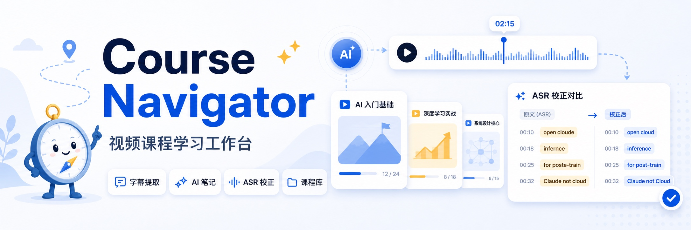
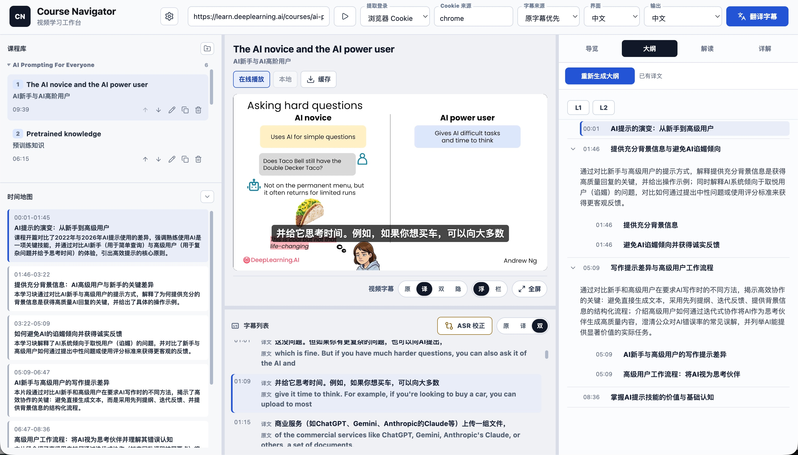
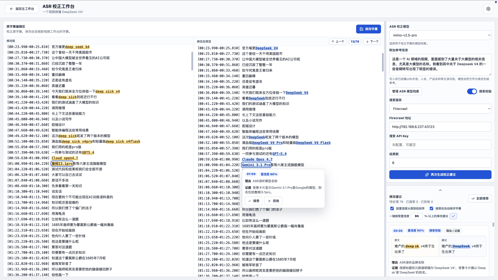

# Course Navigator

[English README](README.en.md)



Course Navigator 是一个视频课程学习工作台。你可以粘贴视频链接或导入本地视频，提取字幕，在视频旁校阅逐字稿，把课程整理成专辑，并用 AI 完成字幕翻译、课程分析和 ASR 字幕校正。

它适合学习者、研究者和需要处理大量课程内容的团队：快速看懂长视频，统一管理课程资料，并在复习时准确跳回对应片段。

## 界面预览



## 主要功能

- 课程库与 Workspace：按专辑管理课程，编辑标题和顺序，导入本地视频，缓存在线视频，并把课程记录、AI 学习材料和本地视频集中保存在 Workspace。
- 课程包分享：导入或导出单课和完整专辑，保留校正字幕、翻译字幕、AI 学习材料、留言、专辑名称和课程顺序。
- 字幕获取：通过 `yt-dlp` 提取平台字幕，也支持本地上传、本地 ASR、在线 ASR、原字幕优先回退和中文简体化。
- 视频访问：公开视频可直接访问；需要登录的网站可复用浏览器登录状态或使用 cookies 文件。
- 播放与校阅：支持视频与字幕联动、点击时间戳跳转、双语字幕视图、时间戳导航、字幕翻译和标题翻译。
- AI 学习地图：生成导览、大纲、解读和详解，支持标准 / 高保真详细程度，并提供初学 / 进阶学习建议。
- ASR 校正工作台：支持术语参考、定点 AI 修改建议、前后对照、悬停理由、置信度排序、批量接受和接受后自动保存。
- 搜索校验：可选使用 Tavily、官方 Firecrawl 或自托管 Firecrawl 校验 ASR 修改候选项。
- 模型档案：翻译、课程分析和 ASR 校正共用模型档案库，支持 OpenAI 兼容格式和 Anthropic 格式。

## 运行要求

- Node.js 20 系列需 20.19 或更新版本；Node.js 22 及更新大版本需 22.12 或更新版本，并包含 npm。
- Python 3.11 或更新版本。
- `uv`，用于管理 Python 依赖。
- `ffmpeg`，启动时可选，但本地视频缓存、音频提取和媒体转换需要它。
- `curl`，启动脚本用于检查服务是否就绪。

`yt-dlp` 会随 Python 依赖安装。

缺少 `ffmpeg` 时应用仍可启动。需要视频缓存或本地音频流程时，可用系统包管理器安装：

```bash
# macOS
brew install ffmpeg

# Ubuntu 或 Debian
sudo apt install ffmpeg

# Windows
winget install Gyan.FFmpeg
```

## 快速开始

```bash
git clone https://github.com/Liu-Bot24/course-navigator.git
cd course-navigator
npm start
```

启动命令会安装依赖、按需创建本地设置文件，并启动 API 与网页应用。缺少 `ffmpeg` 时会提示警告但继续运行。

打开：

```text
http://127.0.0.1:5173
```

在终端按 `Ctrl+C` 可同时停止两个服务。

## macOS 本地安装

当前 macOS 安装包和 Homebrew Cask 支持 Apple Silicon Mac，暂不提供 Intel Mac 版本。

如果你已安装 Homebrew，可以从 GitHub Release 安装 App：

```bash
brew tap liu-bot24/course-navigator https://github.com/Liu-Bot24/course-navigator
brew install --cask liu-bot24/course-navigator/course-navigator
```

以后通过 Homebrew 升级：

```bash
brew update
brew upgrade --cask liu-bot24/course-navigator/course-navigator
```

也可以下载 macOS 安装包，打开 DMG 后将 `Course Navigator.app` 拖到 `Applications`，再从应用程序中启动。

未公证版本首次打开时，macOS 可能需要你在 `系统设置` → `隐私与安全性` 中选择 `仍要打开`。确认安装包来源可信后，通过一次即可正常使用。

完整安装说明见 [macOS 本地安装](docs/mac-install.md)。

## AI 配置

不配置 AI 模型时，Course Navigator 仍可提取、浏览和手动编辑字幕。AI 翻译、课程分析和 ASR 校正需要至少一个模型档案。

在应用设置中新建模型档案，选择服务格式，填写 API 地址、模型名称和 API Key，再分配给需要的任务：

| 任务 | 用途 |
| --- | --- |
| 字幕模型 | 字幕翻译和标题翻译 |
| 学习模型 | 解读和详解文本 |
| 结构模型 | 上下文摘要、语义分块、导览和大纲 |
| ASR 校正模型 | ASR 校正工作台中的修改建议 |

模型档案支持：

| 服务格式 | 常见 API 地址 |
| --- | --- |
| OpenAI 兼容格式 | `https://api.openai.com/v1` 或其他兼容端点 |
| Anthropic 格式 | `https://api.anthropic.com/v1` 或兼容 Anthropic 的端点 |

应用也会读取可选环境配置：

| 配置项 | 作用 | 默认值 |
| --- | --- | --- |
| `COURSE_NAVIGATOR_WORKSPACE_DIR` | 课程资料 Workspace，保存课程记录、AI 学习材料、导入视频和本地视频缓存 | `course-navigator-workspace` |
| `COURSE_NAVIGATOR_DATA_DIR` | 本地运行数据目录，保存字幕提取和 ASR 过程文件 | `.course-navigator` |
| `COURSE_NAVIGATOR_LLM_BASE_URL` | 可选的单模型 API 地址 | 空 |
| `COURSE_NAVIGATOR_LLM_API_KEY` | 可选的单模型 API Key | 空 |
| `COURSE_NAVIGATOR_LLM_MODEL` | 可选的单模型名称 | 空 |
| `COURSE_NAVIGATOR_ASR_SEARCH_ENABLED` | 是否启用搜索辅助 ASR 校正 | `false` |
| `COURSE_NAVIGATOR_ASR_SEARCH_PROVIDER` | ASR 搜索校验服务 | `tavily` |
| `COURSE_NAVIGATOR_ASR_SEARCH_RESULT_LIMIT` | 每次查询返回的搜索结果数 | `5` |
| `COURSE_NAVIGATOR_TAVILY_API_KEY` | Tavily API Key | 空 |
| `COURSE_NAVIGATOR_FIRECRAWL_BASE_URL` | Firecrawl API 地址 | 空 |
| `COURSE_NAVIGATOR_FIRECRAWL_API_KEY` | Firecrawl API Key | 空 |
| `COURSE_NAVIGATOR_ONLINE_ASR_PROVIDER` | 在线 ASR 服务，可选 `none`、`xai`、`openai`、`groq`、`custom` | `none`，有可用 Key 时会自动选择 |
| `COURSE_NAVIGATOR_XAI_ASR_API_KEY` | xAI 在线 ASR API Key | 空 |
| `COURSE_NAVIGATOR_OPENAI_ASR_API_KEY` | OpenAI Whisper API Key | 空 |
| `COURSE_NAVIGATOR_GROQ_ASR_API_KEY` | Groq Whisper API Key | 空 |
| `COURSE_NAVIGATOR_CUSTOM_ASR_BASE_URL` | 自定义在线 ASR 接口地址 | 空 |
| `COURSE_NAVIGATOR_CUSTOM_ASR_MODEL` | 自定义在线 ASR 模型名称 | 空 |
| `COURSE_NAVIGATOR_CUSTOM_ASR_API_KEY` | 自定义在线 ASR API Key | 空 |
| `COURSE_NAVIGATOR_ASR_CACHE_AUTO_CLEANUP_ENABLED` | ASR 过程音频缓存超过 500M 时是否自动清理 | `true` |

Firecrawl 可使用官方服务或自托管服务：

| 使用方式 | Firecrawl 地址 | API Key |
| --- | --- | --- |
| 官方服务 | `https://api.firecrawl.dev` | 填写 Firecrawl 官方后台生成的 API Key |
| 自托管服务 | 你的 Firecrawl 服务地址，例如 `http://192.168.1.10:3002` | 开启鉴权时填写；未开启可留空 |

Firecrawl 地址可只填服务根地址。Course Navigator 请求搜索时会自动使用 `/v1/search`，例如 `https://api.firecrawl.dev` 会请求 `https://api.firecrawl.dev/v1/search`。

在线 ASR 可在应用设置里配置。预设服务只需填写 API Key；自定义接口需要接口地址、模型名称和 API Key。ASR 会尽量生成视频源语言字幕，翻译仍由后续字幕翻译功能完成。

一键启动脚本支持自定义本地端口：

| 配置项 | 作用 | 默认值 |
| --- | --- | --- |
| `COURSE_NAVIGATOR_API_HOST` | API 监听地址 | `127.0.0.1` |
| `COURSE_NAVIGATOR_API_PORT` | API 端口 | `8000` |
| `COURSE_NAVIGATOR_WEB_HOST` | 网页应用监听地址 | `127.0.0.1` |
| `COURSE_NAVIGATOR_WEB_PORT` | 网页应用端口 | `5173` |

## 视频访问模式

Course Navigator 支持三种提取模式：

| 模式 | 适用场景 |
| --- | --- |
| 普通模式 | 视频公开，可直接访问 |
| 浏览器登录状态 | 视频可在浏览器观看，需要复用登录状态 |
| Cookies 文件 | 已为目标网站导出 cookies 文件 |

支持的网站、字幕语言和自动字幕可用性取决于 `yt-dlp` 和视频平台本身。

`浏览器登录状态` 默认使用 `chrome`；`Cookie 来源` 留空时也会按 `chrome` 处理。需要指定来源时，可填写：

| Cookie 来源 | 说明 |
| --- | --- |
| `chrome` | Chrome 默认配置，也是初始值 |
| `chrome:Default`、`chrome:Profile 1` | 指定 Chrome 用户配置 |
| `safari`、`firefox` | 使用 Safari 或 Firefox 的登录状态 |
| `brave`、`chromium`、`edge`、`opera`、`vivaldi`、`whale` | 其他当前支持的浏览器 |

## 字幕来源

| 字幕来源 | 适用场景 |
| --- | --- |
| 原字幕优先 | 优先下载平台已有字幕，缺失时回退到本地 ASR |
| 本地 ASR | 在本机用语音识别生成带时间戳字幕 |
| 在线 ASR | 使用已配置的在线语音识别服务生成带时间戳字幕 |
| 本地上传 | 上传已有 TXT、MD、SRT、VTT 等字幕文本文件 |

提示：哔哩哔哩等平台读取平台原字幕时可能需要登录状态。如果原字幕获取失败或一直没有结果，请先在 Chrome、Safari、Firefox 等浏览器中登录对应网站，再回到 Course Navigator，把视频访问模式切到 `浏览器登录状态`；必要时也可以改用 `Cookies 文件`。

提示：YouTube 等平台的嵌入播放器（iframe）可能会继承浏览器扩展注入的字幕或翻译层，例如沉浸式翻译、自动字幕翻译插件。如果在 Course Navigator 中看到两层字幕或双重翻译，请回到 YouTube 官网页面，在对应扩展中关闭该站点的自动翻译或字幕增强后，再刷新 Course Navigator 播放器。

## 课程管理

课程库可按专辑管理视频，编辑课程和专辑名称，调整课程顺序，复制来源链接，删除课程记录，并管理在线课程的本地视频缓存。对导入的本地视频，视频文件属于课程资料；删除课程会同步删除这份视频文件。专辑适合课程列表、讲座系列、访谈合集或长期学习项目。

## AI 学习材料

字幕可用后，Course Navigator 可按选择的输出语言生成学习材料：

- 导览：前置知识、思考提示、复习建议和快速导读。
- 初学学习建议：提示刚接触该领域的学习者应该重点观看的内容。
- 进阶学习建议：帮助已有基础的学习者判断哪些内容可快速浏览，哪些内容值得复习。
- 大纲：带时间戳的可导航结构。
- 解读：按主要学习块展开的解释性笔记。
- 详解：更完整、适合细读的文本版本。

你可以选择标准或高保真详细程度。标准模式更快，高保真模式会保留更多语义细节。

## ASR 校正

ASR 校正工作台用于处理自动语音识别生成的字幕，并使用与主工作台相同的模型档案库。



你可以：

- 直接编辑字幕文本，
- 添加术语、人名、产品名和常见 ASR 错误作为参考信息，
- 生成定点 AI 校正建议，
- 并排查看原文和修改后预览，
- 在高亮修改上悬停查看理由、证据，并接受或拒绝，
- 在右侧建议区集中审阅所有建议，
- 按置信度排序，
- 一键接受高于指定置信度的建议，
- 开启接受后自动保存，
- 在手动编辑或接受一轮建议后再次执行 AI 校正，
- 需要外部证据时开启 Tavily、官方 Firecrawl 或自托管 Firecrawl 搜索校验。

接受后的修改可保存回视频工作台，作为主字幕列表中的校正字幕使用。

## 手动启动

推荐使用一键启动。如需分开启动服务：

```bash
uv sync
npm install
npm run dev:api
```

再打开另一个终端运行：

```bash
npm run dev
```

## 隐私与数据

Course Navigator 会把课程记录、学习材料、导入视频和本地视频缓存保存在课程资料 Workspace 中。字幕提取、ASR 中间文件和本地设置保存在本地运行数据目录中。升级到 Workspace 存储后，应用会保留已有课程资料并迁移到新的资料位置。

使用 AI 翻译、课程分析或 ASR 校正时，相关字幕文本和上下文会发送给你配置的模型服务。开启搜索辅助 ASR 校正后，搜索查询会发送给你配置的搜索服务。请把 API Key 保存在自己的电脑上，并选择你信任的服务提供方。

完整说明见 [PRIVACY.md](PRIVACY.md)。

## 许可证与安全

Course Navigator 使用 [MIT License](LICENSE) 发布。安全问题和负责任披露方式见 [SECURITY.md](SECURITY.md)。
