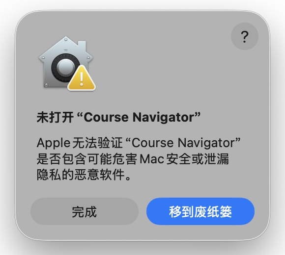
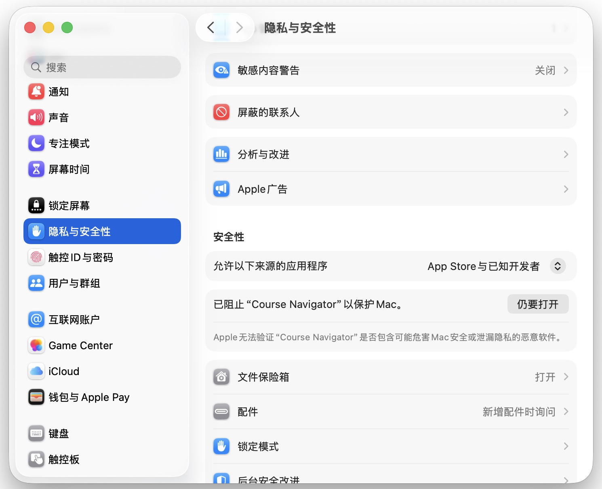
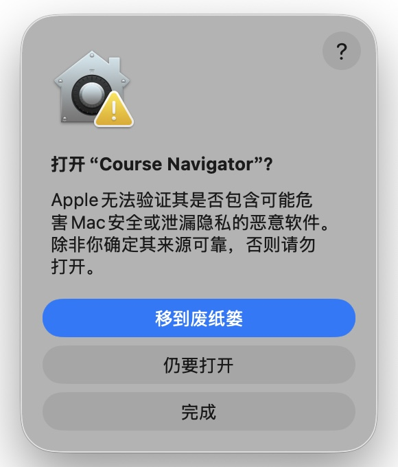

# macOS 本地安装

Course Navigator 提供 macOS 本地安装包时，可以像普通 Mac App 一样安装和启动本地服务。安装包不要求使用 Mac App Store。

## 运行要求

- macOS。
- Apple Silicon Mac。当前 DMG 和 Homebrew Cask 暂不提供 Intel Mac 版本。
- Node.js 20 系列需 20.19 或更新版本；Node.js 22 及更新大版本需 22.12 或更新版本，并包含 npm。
- Python 3.11 或更新版本。
- `uv`，用于安装和运行 Python 后端依赖。
- `ffmpeg`，用于本地视频缓存、音频提取和媒体转换；不使用媒体转换功能时可稍后安装。

如果你使用 Homebrew，可以一次安装：

```bash
brew install node python@3.11 uv ffmpeg
```

## 安装 App

当前 macOS 安装包和 Homebrew Cask 支持 Apple Silicon Mac，暂不提供 Intel Mac 版本。

如果你已安装 Homebrew，可以从 GitHub Release 安装 App：

```bash
brew tap liu-bot24/course-navigator https://github.com/Liu-Bot24/course-navigator
brew install --cask liu-bot24/course-navigator/course-navigator
```

通过 Homebrew 安装后，后续升级可以先退出 Course Navigator，再运行：

```bash
brew update
brew upgrade --cask liu-bot24/course-navigator/course-navigator
```

也可以手动安装：

1. 打开 `Course.Navigator-<version>-macos-arm64.dmg`。
2. 将 `Course Navigator.app` 拖到 `Applications`。
3. 从 `Applications` 打开 Course Navigator。

Homebrew Cask 和 DMG 使用同一个 App 包。未公证版本首次打开时，下面的首次打开提示同样适用。

首次启动会把运行资源安装到：

```text
~/Library/Application Support/Course Navigator/
```

课程资料默认保存在同一目录下的 `Workspace`。你也可以在 App 中改到外置硬盘或其他稳定位置。

第一次启动服务时，Course Navigator 会安装本地运行依赖，需要联网，可能需要几分钟。之后再次启动会更快。

## 首次打开提示

未公证版本首次打开时，macOS 可能会提示无法验证开发者或无法检查 App 是否包含恶意软件。确认安装包来源可信后，可以手动允许打开：

1. 确认 `Course Navigator.app` 已经在 `Applications` 中。
2. 尝试打开 Course Navigator。
3. 看到无法验证的提示后，点击提示窗口里的 `完成` 关闭它，不要选择 `移到废纸篓`。

   

4. 打开 `系统设置`。
5. 进入 `隐私与安全性`。
6. 在安全提示旁选择 `仍要打开`。

   

7. macOS 再次弹出确认提示时，选择 `仍要打开`，不是 `完成` 或 `移到废纸篓`。

   

通过一次后，macOS 会记住这次例外，后续可以正常双击打开。

`仍要打开` 是 macOS Gatekeeper 的临时放行按钮，通常需要先尝试打开 App 后才会出现，并且只会保留一段时间。如果没有看到这个按钮，重新从 `Applications` 尝试打开一次，再回到 `系统设置` → `隐私与安全性`。如果按钮出现但点击没有反应，先关闭 Course Navigator 相关的提示窗口，再重新点击 `仍要打开`。

## 启动台或 Apps 中没有立即出现

拖入 `Applications` 后，安装是否成功以 `/Applications/Course Navigator.app` 是否存在、能否从 Finder 打开为准。启动台或新版 macOS 的 Apps 视图依赖系统索引和 LaunchServices 缓存，可能不会立即刷新。反复删除、替换同名同版本测试包时，这种延迟更常见。

如果 Course Navigator 已经在 `Applications` 中，但启动台或 Apps 里暂时看不到，可以先直接从 Finder 的 `Applications` 目录打开。成功打开一次后，系统通常会在之后的索引刷新中显示它。
